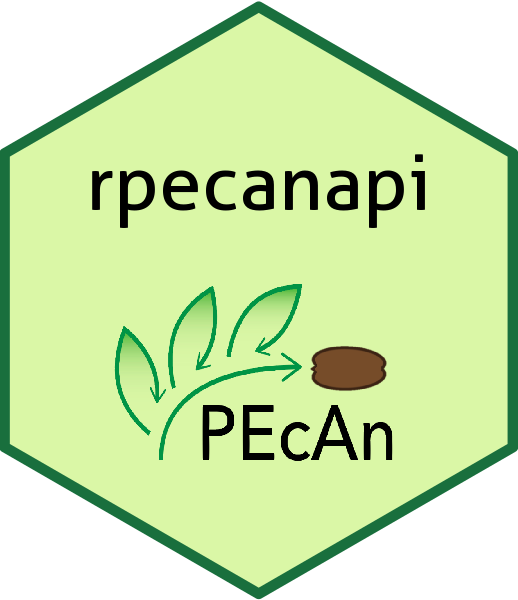

# rpecanapi <a href='https://dplyr.tidyverse.org'></a>

[](https://travis-ci.org/PecanProject/rpecanapi)


## Overview

`rpecanapi` is an open source R package to interact with the PEcAn Project Server(s) & leverage the functionality of the PEcAn bioinformatics toolbox. The Predictive Ecosystem Analyser (PEcAn) Project is an open source framework initiated to meet the demands for more accessible, transparent & repeatable modeling of ecosystems. To know more about the PEcAn Project, check out the [PEcAn Github Repository](https://github.com/PecanProject/pecan)

This package allows users to get relevant information from the PEcAn database as well as submit PEcAn workflows.

## Installation

You can install the development version of `rpecanapi` from GitHub as follows:
```R
# install.packages("devtools")
devtools::install_github("PecanProject/rpecanapi")
```

## Usage

_The following snippets assume that the PEcAn RESTful API Server is running on `http://localhost:8000`. This can be replaced with any
other appropriate PEcAn Server URL._

- [Getting Started](#getting-started)
- [Get Information about PEcAn Models](#get-information-about-pecan-models)
- [Get Information about PEcAn Sites](#get-information-about-pecan-sites)
- [Get Information about PEcAn PFTs (Plant Functional Types)](#get-information-about-pecan-pfts-plant-functional-types)
- [Get Information about PEcAn Formats](#get-information-about-pecan-formats)
- [Get Information about PEcAn Inputs](#get-information-about-pecan-inputs)
- [Get Information about PEcAn Workflows](#get-information-about-pecan-workflows)
- [Submit a PEcAn Workflow for Execution](#submit-a-pecan-workflow-for-execution)
- [Get Information about PEcAn Runs](#get-information-about-pecan-runs)
- [Plots & File Downloads for Workflows & Runs](#plots-file-downloads-for-workflows-runs)

### Getting Started

#### Load `rpecanapi` & Create the Server Object
```R
library(rpecanapi)

server <- connect(url="http://localhost:8000", username="carya", password="illinois")
```

#### Ping the PEcAn API Server
```R
ping(server)

#> $request
#> [1] "ping"

#> $response
#> [1] "pong"
```
#### Get General Information about the Server & PEcAn Version
```R
get.status(server)

#> $pecan_details$version
#> [1] "1.7.0"

#> $pecan_details$branch
#> [1] "develop"

#> $pecan_details$gitsha1
#> [1] "unknown"

#> $host_details$hostid
#> [1] 99

#> $host_details$hostname
#> [1] ""

#> $host_details$start
#> [1] 99000000000

#> $host_details$end
#> [1] 99999999999

#> $host_details$sync_url
#> [1] ""

#> $host_details$sync_contact
#> [1] ""

#> $host_details$authentication_required
#> "TRUE"
```

### Get Information about PEcAn Models

#### Search for PEcAn Model(s):
```R
search.models(server, model_name='sip', revision='r')

#> $models
#>     model_id model_name revision
#> 1 1000000014     SIPNET     r136
#> 2 1000000022     SIPNET      ssr

#> $count
#> [1] 2
```

#### Get the details of a PEcAn Model:
```R
get.model(server, model_id='1000000014')

#> $modeltype_id
#> [1] 3

#> $model_type
#> [1] "SIPNET"

#> $model_id
#> [1] 1000000014

#> $model_name
#> [1] "SIPNET"

#> $revision
#> [1] "r136"

#> $inputs
#>          input required
#> 1          met     TRUE
#> 2 poolinitcond    FALSE
```
### Get Information about PEcAn Sites

#### Search for PEcAn Site(s):
```R
search.sites(server, sitename='willow')

#> $sites
#>           id                                      sitename
#> 1        676                         Willow Creek (US-WCr)
#> 2       1108 Willow Creek (WC)-Chequamegon National Forest
#> 3       1202                                  Tully_willow
#> 4       1223                   Saare SRF willow plantation
#> 5 1000005151                         Willow Creek (US-WCr)

#> $count
#> [1] 5
```

#### Get the details of a PEcAn Site:
```R
get.site(server, site_id='676')

#> $id
#> [1] 676

#> $city
#> [1] "Park Falls Ranger District"

#> $state
#> [1] "Wisconsin"

#> $country
#> [1] "US"

#> $mat
#> [1] 4

#> $map
#> [1] 815

#> $soil
#> [1] ""

#> $som
#> [1] "NA"

#> $notes
#> [1] "MF"

#> $soilnotes
#> [1] ""

#> $sitename
#> [1] "Willow Creek (US-WCr)"

#> $greenhouse
#> [1] FALSE

#> $sand_pct
#> [1] 42.52

#> $clay_pct
#> [1] 20.17

#> $time_zone
#> [1] "America/Chicago"
```
### Get Information about PEcAn PFTs (Plant Functional Types)

#### Search for PEcAn PFT(s):
```R
search.pfts(server, pft_name='deciduous', model_type='sipnet')

#> $pfts
#>   model_type     pft_id                       pft_name pft_type
#> 1     SIPNET         41            temperate.deciduous    plant
#> 2     SIPNET 1000000105         temperate.deciduous.IF    plant
#> 3     SIPNET 1000000107        temperate.deciduous_SDA    plant
#> 4     SIPNET 1000000115        temperate.deciduous.ALL    plant
#> 5     SIPNET 1000000118 temperate.deciduous.ALL.NORMAL    plant
#> 6     SIPNET 2000000017   tundra.deciduous.NGEE_Arctic    plant
#> 7     SIPNET 2000000045  temperate.broadleaf.deciduous    plant

#> $count
#> [1] 7
```

#### Get the details of a PEcAn PFT:
```R
get.pft(server, pft_id='2000000045')

#> $model_type
#> [1] "SIPNET"

#> $pft_id
#> [1] 2000000045

#> $pft_name
#> [1] "temperate.broadleaf.deciduous"

#> $definition
#> [1] "SIPNET Temperate Deciduous PFT with priors on all parameters"

#> $pft_type
#> [1] "plant"
```
### Get Information about PEcAn Formats

#### Search for PEcAn Formats:
```R
search.formats(server, format_name="ameriflux", mimetype="netcdf")

#> $formats
#>               mimetype  format_id           format_name
#> 1 application/x-netcdf         38 AmeriFlux.level2.h.nc
#> 2 application/x-netcdf 1000000005             Ameriflux

#> $count
#> [1] 2
```

#### Get details about a PEcAn Format:
```R
get.format(server, format_id=38)

#> $mimetype
#> [1] "application/x-netcdf"

#> $format_id
#> [1] 38

#> $name
#> [1] "AmeriFlux.level2.h.nc"

#> $notes
#> [1] "Ameriflux Level 2 data files (in netCDF format) ..."

#> $header
#> [1] ""

#> $format_variables
#>       description  name               unit
#> 1 air temperature    TA          degrees C
#> 2      Wind speed                    m s-1
#> ...
```

### Get Information about PEcAn Inputs

#### Search for PEcAn Inputs:
```R
search.inputs(server, model_id=1000000014, site_id=772, host_id=99000000001)

#> $inputs
#>                                sitename model_name revision mimetype   format_name tag hostname   file_name         
#> 1 Niwot Ridge Forest/LTER NWT1 (US-NR1)     SIPNET     r136 text/csv Sipnet.climna met   docker  niwot.clim 
#> 2 Niwot Ridge Forest/LTER NWT1 (US-NR1)     SIPNET     r136 text/csv Sipnet.climna met   docker US-NR1.clim 
#>           file_path          id input_name start_date   end_date
#> 1 /data/sites/niwot 99000000003            2002-01-01 2005-12-31
#> 2 /data/sites/niwot 99000000004            1999-01-01 2003-12-31

#> $count
#> [1] 2
```

#### Download a PEcAn Input File:
```R
download.input(server, input_id=99000000003, save_as="niwot.clim.local")
```
_This will download the requested input file & save it as `niwot.clim.local`_

### Get Information about PEcAn Workflows

#### Get list of PEcAn Workflows:
```R
get.workflows(server, model_id='1000000022', site_id='676')

#> $workflows
#>           id                             folder          started_at site_id   model_id          hostname start_date   end_date
#> 1 1000009900 /fs/data2/output//PEcAn_1000009900 2018-11-09 08:56:37     676 1000000022        geo.bu.edu 2004-01-01 2004-12-31
#> 2 1000009172 /fs/data2/output//PEcAn_1000009172 2018-04-11 18:14:52     676 1000000022 test-pecan.bu.edu 2004-01-01 2004-12-31
#> 3 1000010079 /fs/data2/output//PEcAn_1000010079 2018-12-15 12:32:26     676 1000000022        geo.bu.edu 2004-01-01 2004-12-31
#> 4 1000010213 /fs/data2/output//PEcAn_1000010213 2019-02-08 14:38:45     676 1000000022        geo.bu.edu 2004-01-01 2004-12-31
#> 5 1000010172 /fs/data2/output//PEcAn_1000010172 2019-01-13 09:30:18     676 1000000022        geo.bu.edu 2004-01-01 2004-12-31

#> $count
#> [1] 5
```

#### Get details about a PEcAn Workflow:
```R
get.workflow(server, workflow_id='99000000031')

#> $id
#> [1] "1000010213"

#> $folder
#> [1] "/fs/data2/output//PEcAn_1000010213"

#> $hostname
#> [1] "geo.bu.edu"

#> $user_id
#> [1] "NA"

#> $properties
#> $properties$end
#> [1] "2004/12/31"

#> $properties$lat
#> [1] ""

#> $properties$lon
#> [1] ""

#> $properties$pft
#> [1] "boreal.coniferous"

#> $properties$email
#> [1] ""

#> $properties$notes
#> [1] ""

#> $properties$start
#> [1] "2004/01/01"

#> $properties$siteid
#> [1] "676"

#> $properties$modelid
#> [1] "1000000022"

#> $properties$hostname
#> [1] "geo.bu.edu"

#> $properties$sitename
#> [1] "WillowCreek(US-WCr)"

#> $properties$input_met
#> [1] "CRUNCEP.SIPNET"

#> $properties$sitegroupid
#> [1] "1"

#> $properties$input_poolinitcond
#> [1] "-1"

#> $files
#> [1] "pecan.CHECKED.xml"                                    "pecan.CONFIGS.xml"
#> ...
```

### Submit a PEcAn Workflow for Execution

#### Submit a workflow directly using user-specified parameters
```R
submit.workflow(
  server, 
  model_id=1000000014, 
  site_id=772, 
  pfts=c("temperate.coniferous"), 
  start_date="2002-01-01", 
  end_date="2003-12-31", 
  inputs=list(
    met=list(id=99000000003)
  )
)

#> $workflow_id
#> [1] 99000000001

#> $status
#> [1] "Submitted successfully"
```

#### Submit a workflow as an XML file
_This assumes the presence of an XML file `test.xml` containing the specifications of the workflow._

```R
submit.workflow.xml(server, xmlFile='test.xml')
#> $workflow_id
#> [1] 99000000002

#> $status
#> [1] "Submitted successfully"
```

#### Submit a workflow as a JSON file
_This assumes the presence of a JSON file `test.json` containing the specifications of the workflow._
```R
submit.workflow.json(server, xmlFile='test.json')
#> $workflow_id
#> [1] 99000000003

#> $status
#> [1] "Submitted successfully"
```

### Get Information about PEcAn Runs

#### Get list of Runs belonging to a PEcAn Workflow
```R
get.runs(server, workflow_id='1000009172')

#> $runs
#>     runtype ensemble_id workflow_id         id   model_id site_id parameter_list start_time finish_time
#> 1  ensemble  1000017624  1000009172 1002042201 1000000022     796     ensemble=1 2005-01-01  2011-12-31
#> 2  ensemble  1000017624  1000009172 1002042202 1000000022     796     ensemble=2 2005-01-01  2011-12-31
#> 3  ensemble  1000017624  1000009172 1002042203 1000000022     796     ensemble=3 2005-01-01  2011-12-31
#> 4  ensemble  1000017624  1000009172 1002042204 1000000022     796     ensemble=4 2005-01-01  2011-12-31
#> 5  ensemble  1000017624  1000009172 1002042205 1000000022     796     ensemble=5 2005-01-01  2011-12-31
#> ...

#> $count
#> [1] 50

#> $next_page
#> [1] "http://localhost:8000/api/runs/?workflow_id=1000009172&offset=50&limit=50"
```

#### Get details about a PEcAn Run

```R
get.run(server, run_id='99000000282')
#> $runtype
#> [1] "sensitivity analysis"

#> $ensemble_id
#> [1] 99000000002

#> $workflow_id
#> [1] 99000000031

#> $id
#> [1] 99000000282

#> $model_id
#> [1] 1000000014

#> $site_id
#> [1] 772

#> $start_time
#> [1] "2002-01-01"

#> $finish_time
#> [1] "2005-12-31"

#> $parameter_list
#> [1] "quantile=15.866,trait=dVPDSlope,pft=temperate.coniferous"

#> $started_at
#> [1] "2020-07-21 21:42:09"

#> $finished_at
#> [1] "2020-07-21 21:43:11"

#> $inputs
#> $inputs$info
#> [1] "README.txt"

#> $inputs$others
#> [1] "sipnet.clim"          "sipnet.in"            "sipnet.param"         "sipnet.param-spatial"

#> $outputs
#> $outputs$logfile
#> [1] "logfile.txt"

#> $outputs$info
#> [1] "README.txt"

#> $outputs$years
#> $outputs$years$`2002`
#> $outputs$years$`2002`$data
#> [1] "2002.nc"

#> $outputs$years$`2002`$variables
#> $outputs$years$`2002`$variables$GPP
#> [1] "Gross Primary Productivity"

#> $outputs$years$`2002`$variables$NPP
#> [1] "Net Primary Productivity"

#> ...
```
### Plots & File Downloads for Workflows & Runs

#### Plot the desired variables from the results of a PEcAn Run:

```R
plot_run_vars(
      server_invalid, 
      run_id=99000000283, 
      year=2002, 
      y_var="TotalResp", 
      x_var="SoilResp"
    )
```
_This will produce a `plot.png` file containing the requested plot_

#### Download an Input File for a Run:
```R
download.run.input(server, run_id=99000000283, filename="sipnet.in", save_as="sipnet.in.local")
```
_This will download the requested input file & save it as `sipnet.in.local`_

#### Download an Output File for a Run:
```R
download.run.output(server, run_id=99000000283, filename="2002.nc", save_as="local.2002.nc")
```
_This will download the requested output file & save it as `local.2002.nc`_

#### Download a File for a Workflow:
```R
download.workflow.file(server, filename="pecan.xml", save_as="local.pecan.xml")
```
_This will download the requested file & save it as `local.pecan.xml`_
***

_Please note that this package is under active development & some functionality may not be ready to use._
